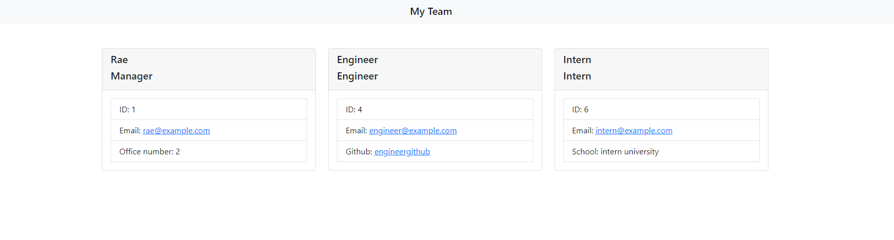

# Team Profile Generator

<a href="https://drive.google.com/file/d/1NLGmgAzXlX2jkQYzsH2szpqRkaozfgDw/view?usp=sharing">Video Demonstration</a>

## The Repository

This repository is where I (Rae Alejandrino) write and implement a fully functioning Team Profile Generator using JavaScript, Node, Jest, and Inquirer.

## Team Profile Generator

In this repository, you can find all the files neccesary to run this Team Profile Generator. Upon running the app.js file, the user will be prompted to enter information on the team manager, and whether or not they'd like to enter information for as many employees as they want to add. After finishing the prompt, the application will then create an html file based on the user's inputs. 